#### Simultaneous Localization and Mapping (SLAM) algorithm for environment mapping using robot wheel odometry and LIDAR data

SLAM corrects for suboptimal robot dimension parameter settings

| Occupancy Map - Odometry only, width = 500 mm | Path - Odometry only, width = 500 mm | Occupancy Map - SLAM, width = 500 mm | Path - SLAM, width = 500 mm|
:-------------------------:|:-------------------------:|:-------------------------:|:-------------------------:
  |  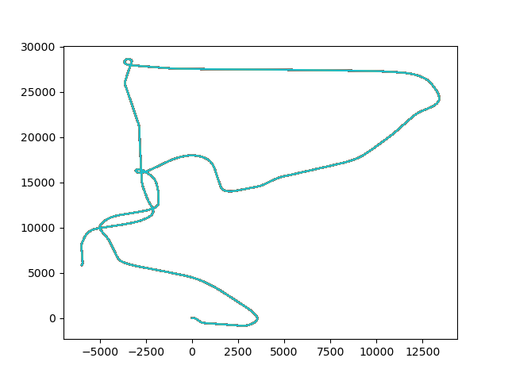 |   |  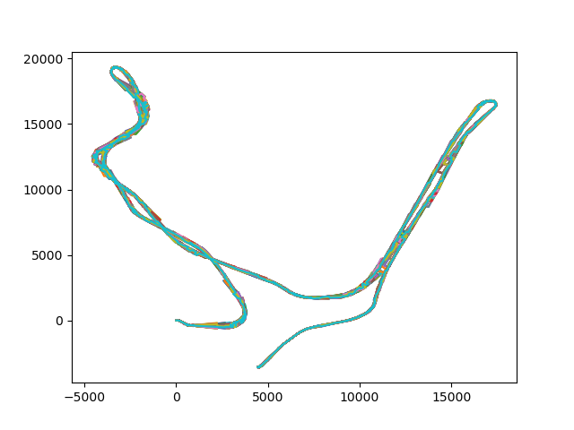
  |   | 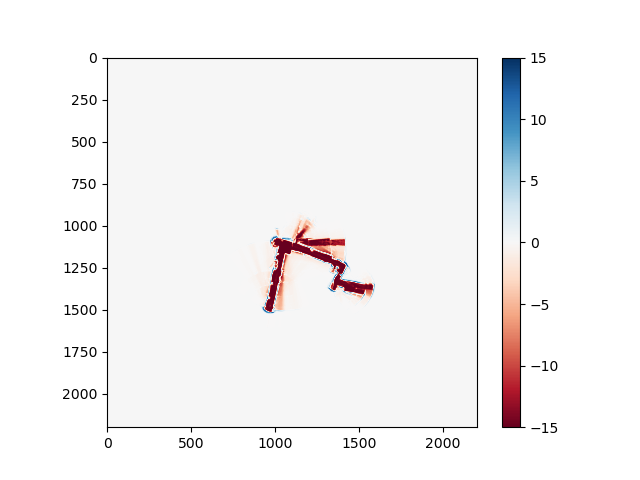  |  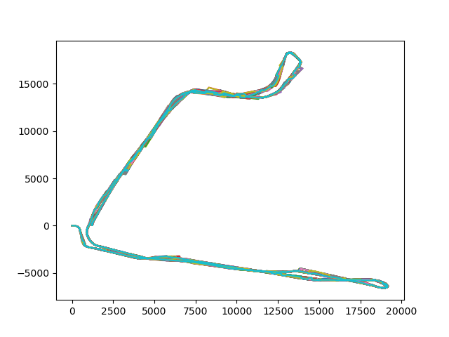
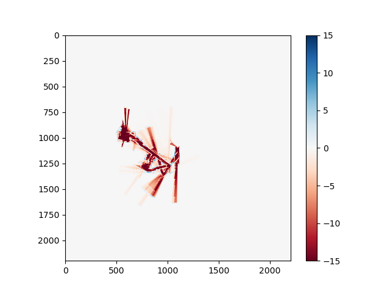  |   |   |  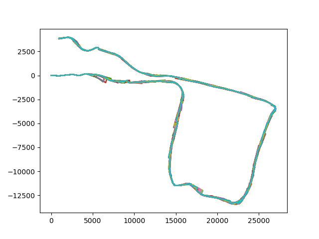

SLAM further refines robot trajectory and environment map when the robot dimension parameter is close to optimal
| Occupancy Map - Odometry only, width = 730 mm | Path - Odometry only, width = 730 mm | Occupancy Map - SLAM, width = 730 mm | Path - SLAM, width = 730 mm|
:-------------------------:|:-------------------------:|:-------------------------:|:-------------------------:
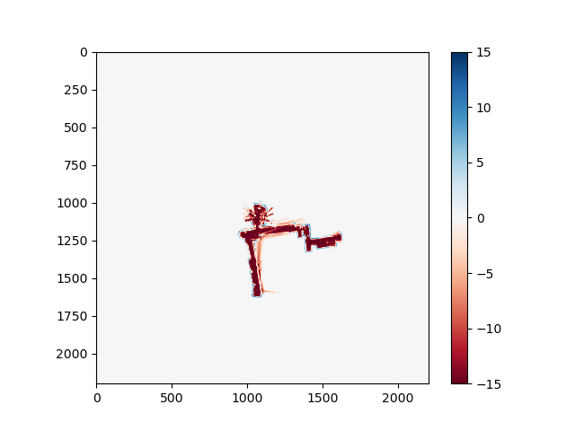  |  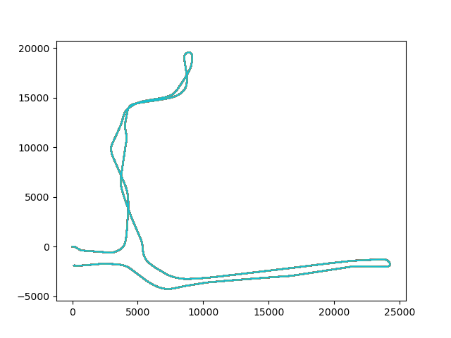 |   |  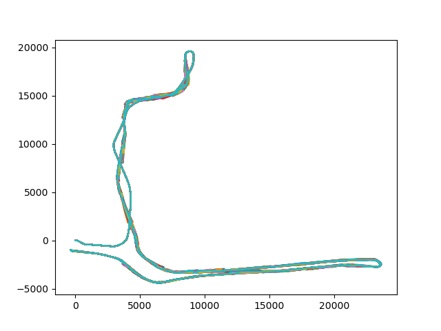
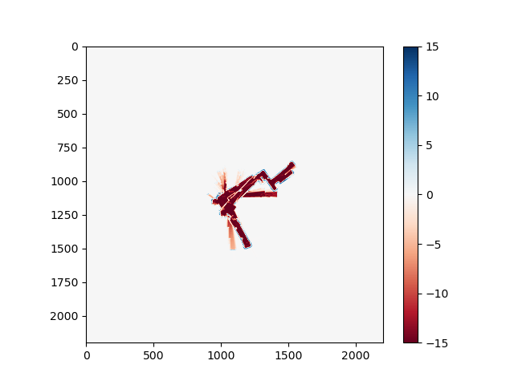  |   | 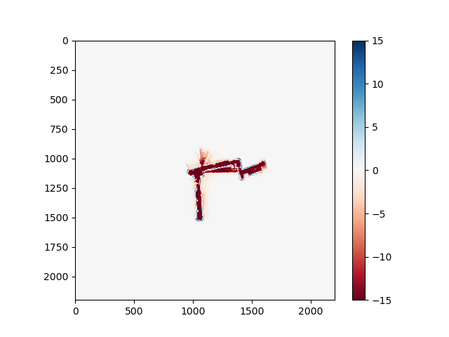  |  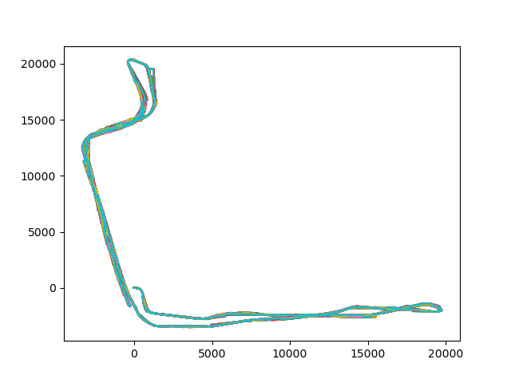
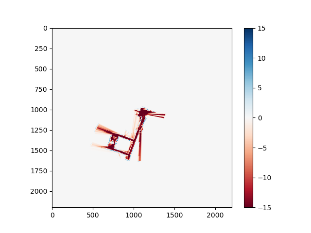  |   |   |  


# Usage
Install micromamba or mamba as the package manager. To install micromamba, refer to the [installation guide](https://mamba.readthedocs.io/en/latest/installation/micromamba-installation.html)

To install the classifier:
1. Clone the repo
```
git clone https://github.com/fyng/SLAM.git
```
```
cd SLAM
```

2. Create virtual environment
```
micromamba env create -f environment.yml
```
```
micromamba activate slam
```

3. Create directory for data and plots


4. Run model
In `main.py`, update the directory of the test folder. Chnage the car variables as needed
```
python main.py
```