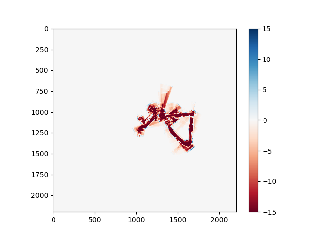

# Introduction
In this project, I implemented a Simultaneous Localization and Mapping (SLAM) algorithm for environment mapping using robot wheel odometry and LIDAR data. Reproducible code is available as a [git repository](https://github.com/fyng/SLAM)

# Problem Statement
We are given time-series measurements of wheel odometry data and LIDAR scan data, as well as geometric measurements of the robot. The goal is to map the robot's trajectory while mapping the environment (empty space v.s. obstructions) on a 2D plane.

# Data
The dataset consists of physical measurements of the robot, LIDAR scan data, and wheel odometry data of a 4-wheeled robot. 
- Physical measurements: refer to the [spec sheet](./docs/platform_config.pdf) for details. 
    - wheel diameter: 254 mm
    - wheelbase: 330.2 mm
    - distance between wheels (inner walls): 311.15 mm
    - distance between wheels (outer walls): 476.25 mm
- Odometry measurements: each wheel contains an encoder which measures the wheel rotation. Each data entry is the sum of encoder ticks since the previous timepoint (positive value -> net forward motion). Each tick is 1/360 revolution. The encoder data has the following channels:
    - time: `int` type
    - FR: front right (ticks) 
    - FL: front left (ticks) 
    - RR: rear right (ticks) 
    - RL: rear left (ticks)
- LIDAR measurements: A LIDAR is mounted on the robot and continously scans a cone of -135 to 135 degrees in front of the robot. When the light beam hits an obstable, it bounces back to the detector and a distance is calculated. The LIDAR data has the following channels:
    - time: `int` type
    - scan: `array` of distances of detected obstacles (meters)
    - angle: `array` of angles correspond to the scans (radians)

# Approach
Here I implement two approaches: the naive (odometry only) approach and SLAM. 

In the naive approach, I use dead reckoning to construct a trajectory of the robot. The limitation of this approach is its sensitivity of small errors, e.g. when the robot slips or small deviations in robot dimension parameters. Since the position update is relative, small initial errors can accumulate and produce large deviations in final trajectory. 

SLAM samples from Gaussian noise to create a large number of particles with independently evolving trajectories. A consensus map is constructed taking a weighted sample of the particles based on the agreement of their mapping and the previous consensus map. The sampling procedure can be thought of as simulating a range of robot parameters, making SLAM robust to error. 

## 1. Dead Reckoning
For each time point, we get the incremental distance traveled by a wheel by converting encoder ticks to distance $d$ (mm) via $d = 2 \pi (\frac{ticks}{360})$. To reduce the effect of slippage, we take the average of the front and back wheels to get the distance traveled by the left and right wheels. We also take the average of left and right wheels to get the average distance traveled by the center of mass of the car. Since the interval between timestamps are small, we can get the angle update using the small angle approximation (valid in general for angles < 1 degree):
$$ d\theta = (\frac{\text{right} - \text{left}}{\text{width}}), \qquad \theta = \theta + d\theta$$

Using grade school trigonometry:

$$ dx = (\frac{\text{left} + \text{right}}{2}) \cos \theta \qquad dy = (\frac{\text{left} + \text{right}}{2}) \sin \theta$$

This is implemented as a vectorized numpy operation for better runtime scaling over 100s of particles. To limit the error induced by floating precision, all distance calculations are made in $mm$ and converted to other units downstream as needed.

## 2. Environment mapping
The model maintains a $55m \times 55m$ occupancy grid map at $5cm$ resolution. The value of a grid is its log-probability of being occupied by an obstacle. At each time point, the mounted LIDAR scans the environment and the light ray passes through unoccupied empty space until it hits the first obstacle along its path and bounces back. Each LIDAR beam is mapped to (1) a single occupied grid coordinates, and (2) a series of empty grid coordinates via `getMapCellsFromRay_fclad()`. 

For each time point, a contact updates the log-probability of a grid coordinate by +1, while a passthrough updates the log-probability of a grid coordinate by -0.1. Therefore, a LIDAR beam will need to pass through a coordinate for 10 subsequent timepoints to clear a obstacle registration. The absolute log-probability of each grid is capped at 15, which prevents the map from becoming too confident.

>**NOTE ON LIDAR DATA**:
 Each LIDAR beam consists of $n$ (angle, distance) tuples undergoes preprocessing before being used in mapping. First, LIDAR beams with distance < 0.1 meters are discarded as this might be reflecting off the robot itself. The maximum spec-ed range of the LIDAR is 30 meters, so any beams with distance > 30 meters is also removed. Lastly, the (angle, distance) tuples are translated from the robot frame to the world frame. 

## 3. SLAM
The intuition of SLAM is that adding noise to the position and orientation of particles can correct for rolling with slipping or non-optimal parameter choice for the robot. In my implementation, 200 particles are seeded. Noise is added to the particles every $n$ iterations. Noise is only added to $\theta$, which will effectively add noise to $x, y$ as the particles independently evolve. In particular, I chose to scale the noise as a function of the current $d\theta$. This helps correct for unoptimal robot width - if the robot is not turning, there is no $\theta$ error, but the $\theta$ error increases when the turn is sharp. The scaling factor is parameterized by `theta_scale`

Each particle has a weight, which is updated at each time step by the correspondance between the particle's map and the current best map. The correspondence is measured by the log-probability of the pixel that is detected as occupied. 
$$corr = \sigma(\sum_{i \in{\text{lidar obstacles}}} \text{occupancy grid}_i)$$
The better the correspondance, the higher the sum. The value is passed through a sigmoid to ensure non-negativity, and multiplied to the weight of the previous timepoint before re-normalizing. 
$$w_{t+1} = w_t \times corr$$

The 'exploration' of the particles are determined by the reseeding interval. The intuition is that the LIDAR of the robot only covers the forward cone, so sufficient time needs to occur between reseeding to allow the robot to turn such that it will encounter previous obstacles in its field of view. However, if the reseeding interval is too long, the robot will completely deviate off course and loss its dead_reckoning. I experimented with constant reseeding intervals and found it best to dynamically set the reseeding interval by checking the number of effective particles. Resampling when $n_effective < 0.8$ works well.
$$\text{n\_{effective}} = \frac{\sum w^2}{(\sum w)^2}$$

During reseeding, the particles with higher overall correspondence have a higher probability of being selected. The probability is determined by the weight of the particle. The particles are sampled *with replacement* using the weights until 200 particles are reselected. After reseeding, all particle weights will be reset to be uniform

# Results
For the naive algorithm (odometry only), I used 730 mm as the width, which produced the most reasonable path traces. The SLAM algorithm further refined the alignment of wall features and reduced the "smearing effect" of wheels slipping during turns.

The naive algorithms maps poorly at width = 500 mm, but using the SLAM algorithm recovers the geometry of the mapping, although the overall rotation of the map with respect to the grid suffers.

**Test dataset:**

Occupancy Map - Odometry only, width = 730 mm | Path - Odometry only, width = 730 mm | Occupancy Map - SLAM, width = 730 mm | Path - SLAM, width = 730 mm
:-------------------------:|:-------------------------:|:-------------------------:|:-------------------------:
  |   |   |  
  |   |   |  

| Occupancy Map - Odometry only, width = 500 mm | Path - Odometry only, width = 500 mm | Occupancy Map - SLAM, width = 500 mm | Path - SLAM, width = 500 mm|
:-------------------------:|:-------------------------:|:-------------------------:|:-------------------------:
  |   |   |  
  |   |   |  

**Train dataset:**

| Occupancy Map - Odometry only, width = 730 mm | Path - Odometry only, width = 730 mm | Occupancy Map - SLAM, width = 730 mm | Path - SLAM, width = 730 mm|
:-------------------------:|:-------------------------:|:-------------------------:|:-------------------------:
  |   |   |  
  |   |   |  
  |   |   |  

| Occupancy Map - Odometry only, width = 500 mm | Path - Odometry only, width = 500 mm | Occupancy Map - SLAM, width = 500 mm | Path - SLAM, width = 500 mm|
:-------------------------:|:-------------------------:|:-------------------------:|:-------------------------:
  |   |   |  
  |   |   |  
  |   |   |  
